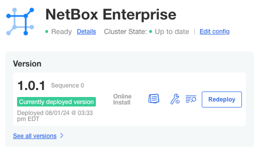

# Embedded Cluster

### Requirements

#### Host system requirements

- 4 Virtual CPU (vCPU)
- 8 GB Memory (RAM)
- 40 GB SSD free disk space

#### Host operating system

- Linux (Kernel versions 4.3 and above)
- Windows Server 2019

#### Architecture

- x86-64
- ARM64

### Deploying the cluster

The following steps are required for an Embedded Cluster (EC) installation of NetBox Enterprise.

1. Download the deployment package and license file to your host (the `Authorization` token should be provided by NetBox Labs):

   ```
   curl https://replicated.app/embedded/netbox-enterprise/stable -H "Authorization: <provided by NetBox Labs>" -o netbox-enterprise-stable.tgz
   ```
2. Uncompress the package and launch the installation:

   ```
   tar -xvzf netbox-enterprise-unstable.tgz
   sudo ./netbox-enterprise install --license license.yaml
   ```

   You’ll be requested to create a password for the NetBox Enterprise admin console. A Kubernetes cluster will then be deployed, ready to host all the NetBox application components. The deployment of the cluster is complete with this message:

   ```{.bash .no-copy} 
   Visit the Admin Console to configure and install netbox-enterprise: http://my.netbox-enterprise.host:30000
   ```

### Deploying NetBox

Access the NetBox Enterprise admin console and configure NetBox

Open the provided URL in a browser. A prompt will require the password created in Step 2:


A wizard will guide the configuration of NetBox for the environment:


Required configuration information includes:

- Version of NetBox to deploy:


- Built-in or external PostgreSQL:


- Built-in or external S3-Compatible object store:


- Advanced settings to configure plugins and SSO remote authentication:


The deployment of NetBox Enterprise will then proceed:


The `Unavailable` status will change to `Ready` once the deployment is complete and NetBox has fully initialized:



### Verify

NetBox Enterprise should now be fully deployed.


