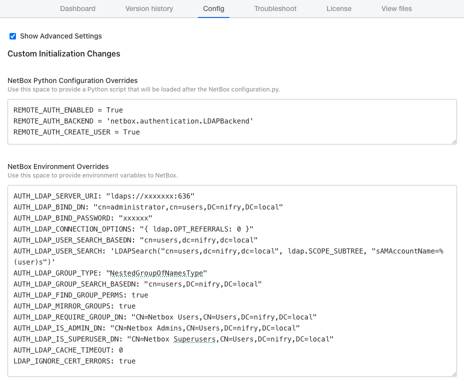

# LDAP Configuration for NetBox Enterprise

1. In the Admin Console for NetBox Enterprise, navigate to the **Config** tab and scroll to the bottom to check **Advanced Settings**
2. Apply the following into **NetBox Python Configuration Overrides**
```python
REMOTE_AUTH_ENABLED = True
REMOTE_AUTH_BACKEND = 'netbox.authentication.LDAPBackend'
REMOTE_AUTH_CREATE_USER = True
```
3. Apply the following into **NetBox Environment Overrides**, replacing the relevant information specific to your environment
```python
AUTH_LDAP_SERVER_URI: "ldaps://xxxxxxx:636"
AUTH_LDAP_BIND_DN: "cn=administrator,cn=users,DC=nifry,DC=local"
AUTH_LDAP_BIND_PASSWORD: "xxxxxx"
AUTH_LDAP_CONNECTION_OPTIONS: "{ ldap.OPT_REFERRALS: 0 }"
LDAP_IGNORE_CERT_ERRORS: true
AUTH_LDAP_USER_SEARCH_BASEDN: "cn=users,dc=nifry,dc=local"
AUTH_LDAP_USER_SEARCH: 'LDAPSearch("cn=users,dc=nifry,dc=local", ldap.SCOPE_SUBTREE, "sAMAccountName=%(user)s")'

AUTH_LDAP_GROUP_TYPE: "NestedGroupOfNamesType"
AUTH_LDAP_GROUP_SEARCH_BASEDN: "cn=users,DC=nifry,DC=local"
AUTH_LDAP_FIND_GROUP_PERMS: true
AUTH_LDAP_MIRROR_GROUPS: true
AUTH_LDAP_REQUIRE_GROUP_DN: "CN=Netbox Users,CN=Users,DC=nifry,DC=local"
AUTH_LDAP_IS_ADMIN_DN: "CN=Netbox Admins,CN=Users,DC=nifry,DC=local"
AUTH_LDAP_IS_SUPERUSER_DN: "CN=Netbox Superusers,CN=Users,DC=nifry,DC=local"
AUTH_LDAP_CACHE_TIMEOUT: 0
LDAP_IGNORE_CERT_ERRORS: true
```
4. Here's how it should look in the end

