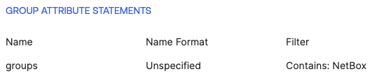

# Configuring SAML Group Mapping in NetBox Enterprise 

Setting up Group Mapping for SAML requires the [base SAML SSO Setup](./nbe-saml.md) to be configured and working first.

## Configure the IdP 

NetBox Enterprise expects a SAML group attribute statement to be named `groups`, which contains a list of group names the user belongs to. If your IdP sends group information under a different attribute name, such as `MemberOf`, you must update its configuration to use `groups` to ensure proper mapping.

Example:



## Configuring Group Mappings  

1. Desired groups must first be configured within NetBox
2. In the Admin Console for NetBox Enterprise, navigate to the **Config** tab and scroll to the bottom to check **Advanced Settings**
3. Apply the following into **NetBox Python Configuration Overrides**, replacing the relevant information.

``` python
SOCIAL_AUTH_PIPELINE = (
'social_core.pipeline.social_auth.social_details',
'social_core.pipeline.social_auth.social_uid',
'social_core.pipeline.social_auth.social_user',
'social_core.pipeline.user.get_username',
'social_core.pipeline.social_auth.associate_by_email',
'social_core.pipeline.user.create_user',
'social_core.pipeline.social_auth.associate_user',
'netbox.authentication.user_default_groups_handler',
'social_core.pipeline.social_auth.load_extra_data',
'social_core.pipeline.user.user_details',
'nbc_auth_extensions.saml_authentication.saml_map_groups',
)

SOCIAL_AUTH_PIPELINE_CONFIG = {
    'SAML_USER_FLAGS_BY_GROUP': {
        "is_staff": {
            "idp-staff-group-name" # remove this line if no group should be granted 'Staff'
        },
        "is_superuser": {
            "idp-superuser-group-name" # remove this line if no group should be granted 'Superuser'
        }
    },
    'SAML_GROUP_MAP': {
        "idp-group-name-1": "netbox-group-name-1",
        "idp-group-name-2": "netbox-group-name-2"
    }
}
```

