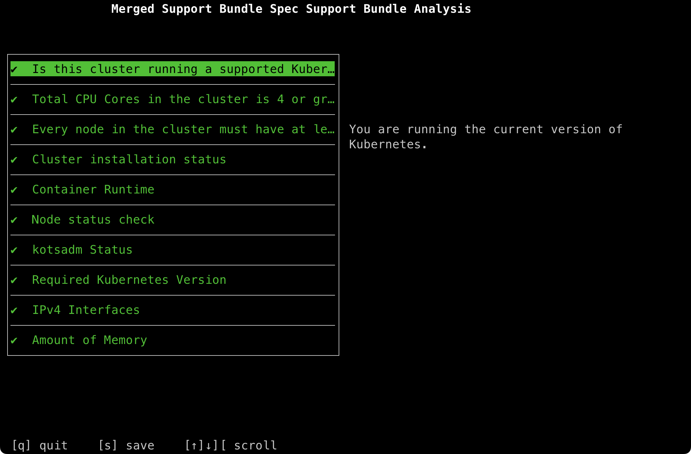

# Advanced Tools and Troubleshooting

NetBox Enterprise is designed to harness the power of Kubernetes while minimizing the amount of work the average person needs to manage it.
However, sometimes it's still useful or necessary to peek under the hood.

## Applications

The following applications are used for various facets of administration:

* [kubectl](https://kubernetes.io/docs/tasks/tools/)\*: CLI for interacting with clusters.
* [preflight](https://troubleshoot.sh/)\*: CLI for manually running preflight validation checks.
  Install by running:<br>
  `curl https://krew.sh/preflight | bash`
* [support-bundle](https://troubleshoot.sh/)\*: CLI for manually generating support bundles.
  Install by running:<br>
  `curl https://krew.sh/support-bundle | bash`
* [k9s](https://k9scli.io/): a TUI for managing and viewing cluster resources.

_\* provided by the NetBox Enterprise install_

## Accessing Your Cluster from the Command Line

<!--
### NetBox Enterprise Installer
-->

If you are running the NetBox Enterprise installer, you will need to first execute a command to get a shell environment that knows how to interact with it.  To do this, run:

```shell
/var/lib/embedded-cluster/bin/netbox-enterprise shell
```

<!--
### KOTS Install

If you are running your own cluster and have installed using KOTS, make sure you have `kubectl` in your `PATH` and that it is able to access your cluster.

The specifics will depend on the type of cluster and where you are accessing it from.

-->

## Accessing Your Cluster from the Web

<!--
### Embedded Cluster
-->

The admin console is always available at `https://your-cluster-host-or-ip:30000/` in a default NetBox Enterprise install.

<!--
### KOTS Install

To access the admin console in a KOTS install, run:

```shell
kubectl kots admin-console --namespace netbox-enterprise
```

This will create a port-forward into the cluster and provide you with a link to reach the console.

-->

## Generating a Support Bundle

### Command-Line

[Access your cluster](#accessing-your-cluster-from-the-command-line) from the shell.  If you haven't [installed the `support-bundle` package](#applications), do so now.

Run:
```
kubectl support-bundle /var/lib/embedded-cluster/support/host-support-bundle.yaml --load-cluster-specs
```

This will run a series of tests and provide a short summary of what it found, much like the preflights that run during install and when deploying.
When complete, the TUI will display, like so:


Typing `s` to save will save a short summary `.txt` file of the output you can see in the TUI.
Typing `q` to quit will quit without saving the summary.
In both cases, a `.tar.gz` support bundle will _also_ be created in the current directory.
This file can be used by NetBox Labs to troubleshoot your system.