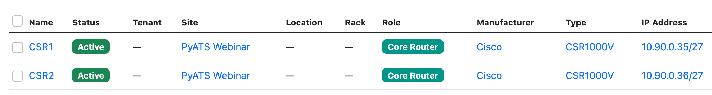
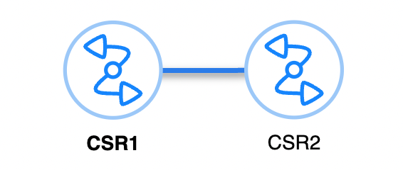

# Getting Started With NetBox, PyATS and Genie

!!! info "Learn More"
    You can view an on-demand Webinar [Getting Started with Network Test Automation: NetBox + pyATS](https://netboxlabs.com/events/webinar-getting-started-with-network-test-automation-netbox-pyats-genie/) hosted by NetBox Labs. 

## Code Examples
All code used in the examples below can be found in the NetBox Learning [git repository](https://github.com/netboxlabs/netbox-learning), in the directory `netbox-pyats-webinar`.

### Set Up and Installation

1. Clone the Git repo and change into the `netbox-pyats-webinar` directory:
    ```
    git clone https://github.com/netboxlabs/netbox-learning.git
    cd netbox-learning/netbox-pyats-webinar
    ```
2. Create and activate Python 3 virtual environment:
    ```
    python3 -m venv ./venv
    source venv/bin/activate
    ```
3. Upgrade pip:
    ```
    python3 -m pip install --upgrade pip
    ```
4. Install PyATS: 

    As per the official [documentation](https://developer.cisco.com/docs/pyats/api/), there are a options to perform a minimal installation (option 1) or a full installation (opton 2).  

    **Option 1**
    Minimal install that includes the Genie library and that allows you to use the interactive testbed creation command to create your testbed files from NetBox: 
    ```
    pip install pyats[library]
    pip install pyats.contrib
    ```

    **Option 2**
    Full installation that includes all packages and libraries: 
    ```
    pip install pyats[full]
    ```

    !!! tip
        If you are using Zsh on a Mac then you need to quote the install string.
    ```
    pip install "pyats[full]"
    ```
    
    !!! Note
        If you plan to run the example script `ospf_neighbor_table.py` then you will also need to install the `prettytable` library with `pip install prettytable` or you can simply run the command `pip install -r requirements.txt` to install this along with pyATS, Genie and the `contrib` library. 

    There is also a [PyATS Docker Image](https://developer.cisco.com/codeexchange/github/repo/CiscoTestAutomation/pyats-docker). This command will pull down the container if you don't have it locally and drop you into a Bash shell: 
    ```
    docker run -it ciscotestautomation/pyats:latest /bin/bash
    ```

## Lab Network

Our lab network consists of 2 x Cisco CSR100V routers and they are documented in NetBox under the Site `PyATS Webinar` and are directly connected to each other over port `GigabitEthernet2` on the `192.168.1.0/30` subnet. They are both running OSPF, and you can find the the configuration for this in the [initial_device_configs.md](https://github.com/netboxlabs/netbox-learning/blob/develop/netbox-pyats-webinar/initial_device_configs.md) file: 

  

  

### Generating The testbed file Dynamically from NetBox Inventory

**Option 1**
Use the `pyats create testbed netbox` command to build your testbed file. Note that where a value is prefixed with `os.getenv` or `%ENV` then these values are being pulled in from the local environment variables that you need to set with the `export` command eg. `export NETBOX_URL=https://example.cloud.netboxapp.com/`, `export DEF_PYATS_USER=admin`: 

```
pyats create testbed netbox \
--output testbed.yaml \
--netbox-url=${NETBOX_URL} \
--user-token=${NETBOX_USER_TOKEN} \
--def_user='%ENV{DEF_PYATS_USER}' \
--def_pass='%ENV{DEF_PYATS_PASS}' \
--url_filter='site=pyats-webinar' \
--topology
```

In this example we are generating a testbed file called `testbed.yaml` and filtering NetBox by the site name `pyats-webinar`. When you hit enter the output will look like this: 

```
Begin retrieving data from netbox...
Configuring testbed default credentials.
Retrieving associated data for CSR1...
Retrieving associated data for CSR2...
Testbed file generated: 
testbed.yaml 
```
**Option 2**
Run the `generate_testbed_file.py` Python script. Note that where a value is prefixed with `os.getenv` or `%ENV` then these values are being pulled in from the local environment variables that you need to set with the `export` command eg. `export NETBOX_URL=https://example.cloud.netboxapp.com/`, `export DEF_PYATS_USER=admin`.

In this script we are generating a testbed file called `testbed.yaml` and filtering NetBox by the site name `pyats-webinar`, but you could just as easily filter on other fields as in the examples commented out: 

```
# Description: This script generates a testbed file based on the Netbox data
#              using the pyATS framework. It uses the Netbox class from the
#              pyats.contrib.creators.netbox module to create the testbed file.

# Import the necessary libraries
from pyats.contrib.creators.netbox import Netbox
import yaml
import os

# Define Netbox URL, user token, and default credentials
netbox_url = os.getenv('NETBOX_URL')
user_token = os.getenv('NETBOX_USER_TOKEN')
def_user = '%ENV{DEF_PYATS_USER}'
def_pass = '%ENV{DEF_PYATS_PASS}'
url_filter = 'site=pyats-webinar'
# url_filter = 'site_id=68'
# url_filter = 'site=pyats-webinar&os=ios-xe'
# url_filter = 'platform=ios-xe'

# Create testbed object and build data structure
nb_testbed = Netbox(
    netbox_url=netbox_url,
    user_token=user_token,
    def_user=def_user,
    def_pass=def_pass,
    url_filter=url_filter,
    ssl_verify=False,
    topology=True
)

# Generate testbed file
tb = nb_testbed._generate()
tb_yaml = yaml.dump(tb)
with open("testbed.yaml", "w") as f:
    f.write(tb_yaml)
```

The resulting testbed file produced by either option will look something like this, depending on your network. Note that as we included the `--topology` switch the testbed file output includes the interfaces and connections from NetBox also: 
```
devices:
  CSR1:
    alias: CSR1
    connections:
      cli:
        ip: 10.90.0.35
        protocol: ssh
    credentials:
      default:
        password: '%ENV{DEF_PYATS_PASS}'
        username: '%ENV{DEF_PYATS_USER}'
    os: iosxe
    platform: iosxe
    type: CSR1000V
  CSR2:
    alias: CSR2
    connections:
      cli:
        ip: 10.90.0.36
        protocol: ssh
    credentials:
      default:
        password: '%ENV{DEF_PYATS_PASS}'
        username: '%ENV{DEF_PYATS_USER}'
    os: iosxe
    platform: iosxe
    type: CSR1000V
testbed:
  credentials:
    default:
      password: '%ENV{DEF_PYATS_PASS}'
      username: '%ENV{DEF_PYATS_USER}'
topology:
  CSR1:
    interfaces:
      GigabitEthernet1:
        alias: CSR1_GigabitEthernet1
        ipv4: 10.90.0.35/27
        type: ethernet
      GigabitEthernet2:
        alias: CSR1_GigabitEthernet2
        ipv4: 192.168.1.1/30
        link: cable_num_34
        type: ethernet
      GigabitEthernet3:
        alias: CSR1_GigabitEthernet3
        type: ethernet
      GigabitEthernet4:
        alias: CSR1_GigabitEthernet4
        type: ethernet
      GigabitEthernet5:
        alias: CSR1_GigabitEthernet5
        type: ethernet
  CSR2:
    interfaces:
      GigabitEthernet1:
        alias: CSR2_GigabitEthernet1
        ipv4: 10.90.0.36/27
        type: ethernet
      GigabitEthernet2:
        alias: CSR2_GigabitEthernet2
        ipv4: 192.168.1.2/30
        link: cable_num_34
        type: ethernet
      GigabitEthernet3:
        alias: CSR2_GigabitEthernet3
        type: ethernet
      GigabitEthernet4:
        alias: CSR2_GigabitEthernet4
        type: ethernet
      GigabitEthernet5:
        alias: CSR2_GigabitEthernet5
        type: ethernet
```

## Structured Data Vs Unstructured Data

When you run a command at the CLI of a network device, you get unstructured data back as the response, which is just a blob of text: 
```
CSR1#sh ip interface brief 
Interface              IP-Address      OK? Method Status                Protocol
GigabitEthernet1       10.0.0.15       YES manual up                    up      
GigabitEthernet2       192.168.1.1     YES manual up                    up      
Loopback0              1.1.1.1         YES manual up                    up  
```

This is great for humans, as we can read this, but a computer cannot understand this data. Also if the next version of the OS you are using makes a change to the way that the output is formatted then you will have a problem and have to re-write your scripts to handle this. This is where the Genie parser comes into play as it will parse the output into structured data. The data is then represented using key/value pairs in JSON format that can be used by a computer: 

```
{
  "interface": {
    "GigabitEthernet1": {
      "interface_is_ok": "YES",
      "ip_address": "10.0.0.15",
      "method": "manual",
      "protocol": "up",
      "status": "up"
    },
    "GigabitEthernet2": {
      "interface_is_ok": "YES",
      "ip_address": "192.168.1.1",
      "method": "manual",
      "protocol": "up",
      "status": "up"
    },
    "Loopback0": {
      "interface_is_ok": "YES",
      "ip_address": "1.1.1.1",
      "method": "manual",
      "protocol": "up",
      "status": "up"
    }
  }
}
```

## Running Your First Tests With The Genie CLI

### Genie Parsing 

There are parsers available for a large number of network OS's (not just Cisco), and you can view the complete list [here](https://pubhub.devnetcloud.com/media/genie-feature-browser/docs/#/parsers. 
)
In this example we will run the `genie parse` command to parse the output of the `show ip ospf neighbor` command and limit it to just device `CSR1`: 

```
genie parse 'show ip ospf neighbor' --testbed-file testbed.yaml --device CSR1
  0%|                                                                                                                                                                | 0/1 [00:00<?, ?it/s]{
  "interfaces": {
    "GigabitEthernet2": {
      "neighbors": {
        "2.2.2.2": {
          "address": "192.168.1.2",
          "dead_time": "00:00:34",
          "priority": 1,
          "state": "FULL/DR"
        }
      }
    }
  }
}
```

This will output the parsed data to your terminal, but if you want to save the output just append the directory you wish to save it to with the `--output` switch. This will save both the `_console` file (the unstructured data) and the `_parsed` file (the structured data), along with the `connection_` log (the raw output of the full connection process) into the chosen directory:

```
genie parse 'show ip ospf neighbor' --testbed-file testbed.yaml --device CSR1 --output csr1
100%|████████████████████████████████████████████████████████████████████████████████████████████████████████████████████████████████████████████████████████| 1/1 [00:01<00:00,  1.01s/it]
+==============================================================================+
| Genie Parse Summary for CSR1                                                 |
+==============================================================================+
|  Connected to CSR1                                                           |
|  -  Log: csr1/connection_CSR1.txt                                            |
|------------------------------------------------------------------------------|
|  Parsed command 'show ip ospf neighbor'                                      |
|  -  Parsed structure: csr1/CSR1_show-ip-ospf-neighbor_parsed.txt             |
|  -  Device Console:   csr1/CSR1_show-ip-ospf-neighbor_console.txt            |
|------------------------------------------------------------------------------|
```

### Genie Learning

In this example we will run the `genie learn` command to learn all about `routing` and `ospf` for both devices in our testbed file. We will also save the output into directory called `pre-change`. Genie will automagically create directories for us if they don't already exist. 

For reference if you run the `genie learn all` command then for IOS-XE devices the list of features learned is: 

```
acl, arp, bgp, device, dot1x, eigrp, fdb, hsrp, igmp, interface, isis, lag, lisp, lldp, mcast, mld, msdp, nd, ntp, ospf, pim, platform, prefix_list, rip, route_policy, routing, static_routing, stp, terminal, utils, vlan, vrf, vxlan, config
```

```
genie learn routing ospf --testbed-file testbed.yaml --output pre-change  

Learning '['routing', 'ospf']' on devices '['CSR1', 'CSR2']'
100%|████████████████████████████████████████████████████████████████████████████████████████████████████████████████████████████████████████████████████████| 2/2 [00:11<00:00,  5.85s/it]
+==============================================================================+
| Genie Learn Summary for device CSR1                                          |
+==============================================================================+
|  Connected to CSR1                                                           |
|  -   Log: pre-change/connection_CSR1.txt                                     |
|------------------------------------------------------------------------------|
|  Learnt feature 'routing'                                                    |
|  -  Ops structure:  pre-change/routing_iosxe_CSR1_ops.txt                    |
|  -  Device Console: pre-change/routing_iosxe_CSR1_console.txt                |
|------------------------------------------------------------------------------|
|  Learnt feature 'ospf'                                                       |
|  -  Ops structure:  pre-change/ospf_iosxe_CSR1_ops.txt                       |
|  -  Device Console: pre-change/ospf_iosxe_CSR1_console.txt                   |
|==============================================================================|


+==============================================================================+
| Genie Learn Summary for device CSR2                                          |
+==============================================================================+
|  Connected to CSR2                                                           |
|  -   Log: pre-change/connection_CSR2.txt                                     |
|------------------------------------------------------------------------------|
|  Learnt feature 'routing'                                                    |
|  -  Ops structure:  pre-change/routing_iosxe_CSR2_ops.txt                    |
|  -  Device Console: pre-change/routing_iosxe_CSR2_console.txt                |
|------------------------------------------------------------------------------|
|  Learnt feature 'ospf'                                                       |
|  -  Ops structure:  pre-change/ospf_iosxe_CSR2_ops.txt                       |
|  -  Device Console: pre-change/ospf_iosxe_CSR2_console.txt                   |
|==============================================================================|
```

## Making a Change to The Network
Let's make a small change to the `CSR2` router in our test network, and remove the `network 2.2.2.2 0.0.0.0 area 0` statement from the OSPF configuration: 

```
CSR2#conf t
Enter configuration commands, one per line.  End with CNTL/Z.
CSR2(config)#router ospf 1
CSR2(config-router)#no network 2.2.2.2 0.0.0.0 area 0
```

Next lets re-learn `routing` and `ospf` for both devices in our testbed file. We will also save the output into directory called `post-change`: 

```
genie learn routing ospf --testbed-file testbed.yaml --output post-change                  

Learning '['routing', 'ospf']' on devices '['CSR1', 'CSR2']'
100%|████████████████████████████████████████████████████████████████████████████████████████████████████████████████████████████████████████████████████████| 2/2 [00:11<00:00,  5.84s/it]
+==============================================================================+
| Genie Learn Summary for device CSR1                                          |
+==============================================================================+
|  Connected to CSR1                                                           |
|  -   Log: post-change/connection_CSR1.txt                                    |
|------------------------------------------------------------------------------|
|  Learnt feature 'routing'                                                    |
|  -  Ops structure:  post-change/routing_iosxe_CSR1_ops.txt                   |
|  -  Device Console: post-change/routing_iosxe_CSR1_console.txt               |
|------------------------------------------------------------------------------|
|  Learnt feature 'ospf'                                                       |
|  -  Ops structure:  post-change/ospf_iosxe_CSR1_ops.txt                      |
|  -  Device Console: post-change/ospf_iosxe_CSR1_console.txt                  |
|==============================================================================|


+==============================================================================+
| Genie Learn Summary for device CSR2                                          |
+==============================================================================+
|  Connected to CSR2                                                           |
|  -   Log: post-change/connection_CSR2.txt                                    |
|------------------------------------------------------------------------------|
|  Learnt feature 'routing'                                                    |
|  -  Ops structure:  post-change/routing_iosxe_CSR2_ops.txt                   |
|  -  Device Console: post-change/routing_iosxe_CSR2_console.txt               |
|------------------------------------------------------------------------------|
|  Learnt feature 'ospf'                                                       |
|  -  Ops structure:  post-change/ospf_iosxe_CSR2_ops.txt                      |
|  -  Device Console: post-change/ospf_iosxe_CSR2_console.txt                  |
|==============================================================================|
```

## Genie Diff
Now let's use the `genie diff` command to tell us what changed in our network, and we will store the output in a directory called `routing-diff`: 

```
genie diff pre-change post-change --output diff 
1it [00:00, 333.44it/s]
+==============================================================================+
| Genie Diff Summary between directories pre-change/ and post-change/          |
+==============================================================================+
|  File: routing_iosxe_CSR2_ops.txt                                            |
|   - Identical                                                                |
|------------------------------------------------------------------------------|
|  File: ospf_iosxe_CSR1_ops.txt                                               |
|   - Identical                                                                |
|------------------------------------------------------------------------------|
|  File: routing_iosxe_CSR1_ops.txt                                            |
|   - Diff can be found at diff/diff_routing_iosxe_CSR1_ops.txt                |
|------------------------------------------------------------------------------|
|  File: ospf_iosxe_CSR2_ops.txt                                               |
|   - Diff can be found at diff/diff_ospf_iosxe_CSR2_ops.txt                   |
|------------------------------------------------------------------------------|
```

There are differences in the outputs of both the `routing_iosxe_CSR1_ops.txt` and `ospf_iosxe_CSR2_ops.txt` files and we can view the contents of those files to see what has changed: 

```
cat diff/diff_routing_iosxe_CSR1_ops.txt 
--- pre-change/routing_iosxe_CSR1_ops.txt
+++ post-change/routing_iosxe_CSR1_ops.txt
 info:
  vrf:
   default:
    address_family:
     ipv4:
      routes:
-      2.2.2.2/32:
-       active: True
-       metric: 2
-       next_hop:
-        next_hop_list:
-         1:
-          index: 1
-          next_hop: 192.168.1.2
-          outgoing_interface: GigabitEthernet2
-          updated: 03:32:43
-       route: 2.2.2.2/32
-       route_preference: 110
-       source_protocol: ospf
-       source_protocol_codes: O%  
```
```
cat diff/diff_ospf_iosxe_CSR2_ops.txt   
--- pre-change/ospf_iosxe_CSR2_ops.txt
+++ post-change/ospf_iosxe_CSR2_ops.txt
 info:
  vrf:
   default:
    address_family:
     ipv4:
      instance:
       1:
        areas:
         0.0.0.0:
          interfaces:
-          Loopback0:
-           bfd:
-            enable: False
-           cost: 1
-           demand_circuit: False
-           enable: True
-           interface_type: loopback
-           name: Loopback0% 
```

As we can see, CSR1 has lost the the route to the `2.2.2.2/32` prefix and on CSR2 the interface `lo0` has been removed from `OSPF area 0`.


## pyATS and Python

As you would expect, it is also very easy to work with pyATS and python. Type `python` in your terminal, and then start by importing the `load` module from the `genie.testbed` library and load the testbed file: 

```
from genie.testbed import load
testbed = load('testbed.yaml') 
```
Then connect to the CSR1 device: 
```
device = testbed.devices['CSR1']
device.connect()
```
Then parse the command `show ip interface brief` and print the output nicely using the `pprint` library:
```
parsed_data = device.parse('show ip interface brief')
from pprint import pprint 
pprint(parsed_data)
{'interface': {'GigabitEthernet1': {'interface_is_ok': 'YES',
                                    'ip_address': '10.0.0.15',
                                    'method': 'manual',
                                    'protocol': 'up',
                                    'status': 'up'},
               'GigabitEthernet2': {'interface_is_ok': 'YES',
                                    'ip_address': '192.168.1.1',
                                    'method': 'manual',
                                    'protocol': 'up',
                                    'status': 'up'},
               'Loopback0': {'interface_is_ok': 'YES',
                             'ip_address': '1.1.1.1',
                             'method': 'manual',
                             'protocol': 'up',
                             'status': 'up'}}}
```
Lastly, close the connection to the device:
```
device.disconnect()
```

As you can imagine, the possibilities are endless and you can see an example of a script that gets and prints OSPF Neighbor table for a given device in the file `ospf_neighbor_table.py`. Run the script and you will get a nicely formatted table of the OSPF neighbors for CRS1:

```
python ospf_neighbor_table.py

OSPF Neighbor Table for CSR1
+------------------+----------+-------------+---------+
|    Interface     | Neighbor |   Address   |  State  |
+------------------+----------+-------------+---------+
| GigabitEthernet2 | 2.2.2.2  | 192.168.1.2 | FULL/DR |
+------------------+----------+-------------+---------+
```

## pyATS Test Scripts and Jobs
So far we have only scratched the surface of what you can do with pyATS, and test scripts will take your automated testing to the next level. Test scripts are written and executed with the [AEtest Python package](https://developer.cisco.com/docs/pyats/api/)

I have included an example test script called `connectivity_check.py`, which is adapted from the example script in the [official documentation](https://developer.cisco.com/docs/pyats/api/). This script tests that both CSR1 and CSR2 can ping each other's loopback addresses. Test scripts are structured Python files that contain/describe the testing you want to do. A clean, elegant test script is scalable, and generates easy-to-read test results and logs.

To run the example test script, you must also specify the testbed file that is to be used, for example: 

```
python connectivity_check.py --testbed testbed.yaml
```

Once the test script has been run then the results are displayed in the output: 

```
2024-04-23T11:50:16: %AETEST-INFO: +------------------------------------------------------------------------------+
2024-04-23T11:50:16: %AETEST-INFO: |                               Detailed Results                               |
2024-04-23T11:50:16: %AETEST-INFO: +------------------------------------------------------------------------------+
2024-04-23T11:50:16: %AETEST-INFO:  SECTIONS/TESTCASES                                                      RESULT   
2024-04-23T11:50:16: %AETEST-INFO: --------------------------------------------------------------------------------
2024-04-23T11:50:16: %AETEST-INFO: .
2024-04-23T11:50:16: %AETEST-INFO: |-- common_setup                                                          PASSED
2024-04-23T11:50:16: %AETEST-INFO: |   |-- check_topology                                                    PASSED
2024-04-23T11:50:16: %AETEST-INFO: |   `-- establish_connections                                             PASSED
2024-04-23T11:50:16: %AETEST-INFO: |       |-- Step 1: Connecting to CSR1                                    PASSED
2024-04-23T11:50:16: %AETEST-INFO: |       `-- Step 2: Connecting to CSR2                                    PASSED
2024-04-23T11:50:16: %AETEST-INFO: |-- PingTestcase[device=device1]                                          PASSED
2024-04-23T11:50:16: %AETEST-INFO: |   |-- ping[destination=192.168.1.1]                                     PASSED
2024-04-23T11:50:16: %AETEST-INFO: |   `-- ping[destination=192.168.1.2]                                     PASSED
2024-04-23T11:50:16: %AETEST-INFO: |-- PingTestcase[device=device2]                                          PASSED
2024-04-23T11:50:16: %AETEST-INFO: |   |-- ping[destination=192.168.1.1]                                     PASSED
2024-04-23T11:50:16: %AETEST-INFO: |   `-- ping[destination=192.168.1.2]                                     PASSED
2024-04-23T11:50:16: %AETEST-INFO: `-- common_cleanup                                                        PASSED
2024-04-23T11:50:16: %AETEST-INFO:     `-- disconnect                                                        PASSED
2024-04-23T11:50:16: %AETEST-INFO:         |-- Step 1: Disconnecting from CSR1                               PASSED
2024-04-23T11:50:16: %AETEST-INFO:         `-- Step 2: Disconnecting from CSR2                               PASSED
2024-04-23T11:50:16: %AETEST-INFO: +------------------------------------------------------------------------------+
2024-04-23T11:50:16: %AETEST-INFO: |                                   Summary                                    |
2024-04-23T11:50:16: %AETEST-INFO: +------------------------------------------------------------------------------+
2024-04-23T11:50:16: %AETEST-INFO:  Number of ABORTED                                                            0 
2024-04-23T11:50:16: %AETEST-INFO:  Number of BLOCKED                                                            0 
2024-04-23T11:50:16: %AETEST-INFO:  Number of ERRORED                                                            0 
2024-04-23T11:50:16: %AETEST-INFO:  Number of FAILED                                                             0 
2024-04-23T11:50:16: %AETEST-INFO:  Number of PASSED                                                             4 
2024-04-23T11:50:16: %AETEST-INFO:  Number of PASSX                                                              0 
2024-04-23T11:50:16: %AETEST-INFO:  Number of SKIPPED                                                            0 
2024-04-23T11:50:16: %AETEST-INFO:  Total Number                                                                 4 
2024-04-23T11:50:16: %AETEST-INFO:  Success Rate                                                            100.0% 
2024-04-23T11:50:16: %AETEST-INFO: --------------------------------------------------------------------------------
```

pyATS Jobs take test scripts to another level and allow the execution of test scripts as tasks. This is beyond the scope of this document but you can read all about pyATS jobs in the [official docs](https://developer.cisco.com/docs/pyats/api/)
